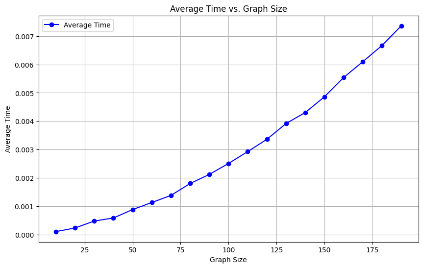

**Title**: Uso de grafos para a otimização da produção de cerveja na indústria

**Authors**:

- Fábio Piemonte Lopes
- Guilherme Novaes Lima
- Henrique Rodrigues de Godoy
- Marcos Vinicyus Rosa Teixeira
- Mariana Brasil Görressen
- Tony Jonas dos Santos Sousa

**Date**: Setembro 2023

**Abstract**: Este artigo aborda a automação da análise de Diagramas de Processo e Instrumentação (P&ID) para otimizar rotas em processos de produção de cerveja, no contexto da engenharia industrial. A complexidade e o esforço manual associados à identificação e otimização de rotas são desafios abordados, com ênfase na eficiência operacional, qualidade do produto e tomada de decisões informadas. O estudo propõe uma solução baseada em grafos usando Neo4j, Java e React para construir uma plataforma web que facilite a visualização das plantas das fábricas e a determinação das rotas de melhor desempenho. O algoritmo A* é utilizado para encontrar as rotas mais eficientes. A análise de complexidade e a prova de correção do algoritmo A* são apresentadas. Os resultados destacam a eficiência da abordagem e sua aplicabilidade na otimização de processos industriais, com foco na gestão de recursos e na redução de custos. A pesquisa sugere que essa abordagem pode ser aplicada em diferentes setores industriais para melhorar a eficiência e a gestão operacional.

# Introdução

O presente artigo aborda a automação da análise de _Process and Instrumentation Diagrams_ (P&ID) para otimização de rotas em processos de produção de cerveja. Essa pesquisa situa-se no campo da engenharia industrial e abrange a área de otimização de processos na indústria cervejeira. Os P&ID's são representações gráficas complexas que delineiam as interconexões entre equipamentos, tubulações e instrumentos em um sistema industrial ([Di Gaspero et al., 2007](#referências-bibliográficas)). No contexto da produção de cerveja, a identificação e seleção de rotas eficientes são cruciais para maximizar a eficiência operacional, minimizar o consumo de recursos e garantir a qualidade do produto final.

O desafio central abordado neste estudo é a complexidade e o esforço manual associados à identificação e otimização de rotas em processos de produção de cerveja. A diversidade de variáveis, como capacidades de equipamentos, restrições mecânicas, sequências de etapas e restrições de processo, torna a análise manual de rotas demorada e suscetível a erros. A ausência de uma abordagem automatizada compromete a eficiência operacional, a qualidade do produto e a tomada de decisões informadas.

Nesse contexto, o tema ganha relevância diante da busca incessante por aprimoramento nos processos industriais, especialmente na indústria cervejeira, que enfrenta uma demanda crescente por qualidade e eficiência ([Golden et al., 2008](#referências-bibliográficas)). A automação da análise de P&ID e a otimização de rotas representam um avanço significativo para a indústria, permitindo a redução de custos, o aumento da produtividade e a minimização do impacto ambiental. Além disso, a pesquisa endereça diretamente a lacuna existente em soluções que lidam com a complexidade de sistemas interconectados, destacando-se como uma ferramenta valiosa para profissionais e tomadores de decisão.

O resultado desse projeto será uma plataforma web que utilizará o banco de dados neo4j\texttrademark em conjunto com a linguagem de programação Java\texttrademark, para construção do _backend_, e o _framework_ React\texttrademark para o confecção do _frontend_. Essa aplicação tem o intuito de facilitar a visualização das plantas das fábricas, demonstrando todos os caminhos possíveis de cerveja dentro das tubulações. O foco está na avaliação dessas rotas, identificando todas as possibilidades, seguido pela determinação da rota de melhor desempenho.

Diversas pesquisas anteriores têm explorado problemáticas semelhantes àquela abordada no presente estudo. Entre elas, destaca-se o artigo intitulado [&#34;Otimização em Grafos aplicada à recomendação de pontos no contexto de cidades inteligentes&#34;](#referências-bibliográficas) publicado em 2020 pelos autores Victor Marques Ferrari Ribeiro e Ismar Frango Silveira. Esse artigo oferece uma contribuição significativa ao apresentar uma solução eficiente para a identificação de áreas residenciais adequadas, considerando a disponibilidade de transporte público na região e os destinos desejados pelo morador. Embora o presente artigo e a obra anteriormente mencionada não estejam diretamente relacionados em termos de setor de aplicação, ambos oferecem abordagens que visam otimizar processos, resultando na redução de gastos e economia de tempo. Essas contribuições demonstram como a pesquisa em otimização por meio do uso de grafos pode ser aplicada de forma interdisciplinar, beneficiando diversas áreas e contextos.

# Metodologia

O estudo inicial foi conduzido com base em uma representação digital de uma cervejaria em formato ".DWG". Esse tipo de arquivo proprietário foi desenvolvido pela Autodesk e abrange ilustrações vetoriais tanto bidimensionais quanto tridimensionais. Essa representação consistia em uma planta contendo componentes vitais para o processo de fabricação de cerveja, englobando tanques, válvulas e dispositivos de entrada e saída. Nesta fase preliminar, uma análise superficial permitiu a identificação dos elementos de maior relevância operacional, os quais foram designados como variáveis-chave. A seleção dessas variáveis considerou critérios que influenciariam de maneira significativa a eficiência do processo de fabricação, bem como variáveis capazes de afetar as rotas percorridas pelo fluxo de cerveja.

As variáveis iniciais escolhidas para a investigação foram os tanques de fermentação, responsáveis pela condução da fermentação alcoólica do mosto, e os tanques de maturação do _green beer_ (cerveja crua). Estes tanques desempenham funções cruciais na purificação, clarificação e desenvolvimento de sabor da cerveja. Além desses elementos, as válvulas solenoide, que exercem controle sobre o direcionamento do fluxo de cerveja, e as válvulas do tipo _mixproof_, projetadas para evitar a intermistura de diferentes líquidos, também foram incluídas no escopo da análise.

A escolha criteriosa dessas variáveis iniciais proporcionou um foco dirigido para o estudo, permitindo a identificação das áreas críticas que impactam diretamente a eficiência e a qualidade do processo de fabricação de cerveja. Essa abordagem proporcionou uma base sólida para a subsequente investigação em busca de otimização e aprimoramento das etapas-chave do processo, contribuindo para a elaboração de estratégias de aprimoramento da produção de cerveja.

Após a seleção das variáveis-chave, procedeu-se com a criação de um modelo computacional através da plataforma de banco de dados neo4j\texttrademark. Esta plataforma adere ao paradigma de teoria de grafos, onde as entidades são representadas como nós, categorizados por diferentes tipos ou "labels". Estes nós contêm atributos específicos que caracterizam as entidades correspondentes. Além disso, a interconexão dos nós é estabelecida por meio de arestas, que definem os relacionamentos entre as entidades. Estas arestas também podem conter atributos para descrever os detalhes dos relacionamentos.

No âmbito da construção desse modelo lógico, as variáveis-chave foram transformadas em entidades, cada uma delas representada como um nó no grafo. Com o intuito de facilitar a identificação e compreensão, todos os nós foram marcados com rótulos específicos. Além disso, características distintivas foram atribuídas a esses nós: para os tanques, a capacidade foi estabelecida como um atributo essencial; no caso das válvulas, o estado (aberto ou fechado) foi claramente especificado.

A partir do modelo lógico, deu-se início à _RESTful API_, ou seja, uma interface de programação de aplicações que consegue responder a requisições de criação (_Create_), leitura (_Read_), atualização (_Update_) e deleção (_Delete_). A principal motivação para a criação dessa _API_ foi de conseguir estabelecer uma boa comunicação entre o banco de dados neo4j\texttrademark e um servidor web, permitindo a aplicação de algoritmos de optimização usando as entidades da fábrica.

A _API_ foi desenvolvida na linguagem de programação Java\texttrademark. Para muitos, a linguagem ficou conhecida inicialmente como uma ferramenta para criar _applets_ para a _World Wide Web_. Um _applet_ é um mini aplicativo executado dentro de uma página da Web. Ele pode executar tarefas e interagir com os usuários em suas páginas do navegador sem usar recursos do servidor Web após o download ([Arnold et al., 2005](#referências-bibliográficas)). No desenvolvimento do servidor, o _framework_ baseado em Java\texttrademark chamado "Spring Boot" e a biblioteca "Spring Data neo4j" foram empregados para a criação dos micro-serviços. A biblioteca fornece métodos essenciais para trabalhar com o banco de dados escolhido e facilita esse processo de comunicação.

Cada _endpoint_ aberto na _API_ realiza uma operação específica do "CRUD" (_Create_, _Read_, _Update_, _Delete_) no banco de dados. Para isso, foi necessária uma abstração do modelo conceitual do banco de dados utilizando o paradigma de programação orientada a objetos (POO). Esse paradigma serviu para representar os nós e arestas do grafo, assim como as variáveis-chave em classes Java\texttrademark.

A arquitetura MVC (_Model_, _Viewer_, _Controller_) desempenhou um papel crucial nesse processo. A abstração de POO mencionada anteriormente é encontrada na camada _Model_. Essa camada é responsável por representar os conceitos do domínio da aplicação em objetos, que, por sua vez, refletem as entidades e relacionamentos presentes no banco de dados. A camada _Controller_ atua como um orquestrador, gerenciando todos os retornos provenientes de cada endpoint. Por fim, a camada _Viewer_ representa o _frontend_ da aplicação e seu desenvolvimento será abordado posteriormente. Resumidamente, essa camada é responsável por proporcionar a interface através da qual os usuários interagem com os dados e funcionalidades disponibilizadas pela _API_.

Após a conclusão da _API_, uma modelagem matemática foi elaborada para representar a problemática de forma numérica. A relevância desse enfoque reside no fato de que ele viabiliza uma análise mais profunda da questão, simplificando a identificação de soluções efetivas. Primeiramente, foi necessário definir a variável de decisão, que, no caso em específico, abrangeu a escolha de um caminho específico, armazenando essa decisão em valores binários. Além disso, as limitações e restrições que regem o problema também precisaram ser identificadas e formalizadas. Essas restrições muitas vezes refletem as condições do mundo real e influenciam diretamente na busca pela solução ótima. Outro passo crucial envolveu a determinação da função objetivo, que representou quantitativamente o que se deseja minimizar no contexto da problemática. Essa função objetiva define os critérios de desempenho que direcionarão a otimização, permitindo avaliar a qualidade das soluções geradas pelo modelo matemático.

$$
\text{Variável de decisão}
$$

$$
x_{i\,j} \begin{cases}
    1;\, \text{Caminho entre $i$ e $j$ foi utilizado} \\ 
    0;\, \text{Caminho entre $i$ e $j$ não foi utilizado}
\end{cases}
$$

$$
\text{Limitações}
$$

$$
\begin{matrix}
    \sum_{i \in E }^{} \sum_{j \in C_{i}^{\ast E} }^{} x_{ij} + \frac{1}{2}\sum_{i \in E }^{} \sum_{j \in C_{i}^{ E} }^{}  x_{ij} = 1 \\
    \sum_{i \in S }^{} \sum_{j \in C_{i}^{\ast S} }^{} x_{ij} + \frac{1}{2}\sum_{i \in S }^{} \sum_{j \in C_{i}^{ S} }^{} x_{ij} = 1
\end{matrix}
$$

$$
\footnotesize{
    \begin{matrix}
        E && \text{Conjunto de todos os nós de entrada} \\ 
        S && \text{Conjunto de todos os nós de saída} \\ 
        C_{i} && \text{Conjunto dos nós que se conectam com o $i$-ésimo nó} \\ 
        C_{i}^{*} && \text{Conjunto dos nós de $C_{i}$ que não se conectam com outras entradas} \\ 
        C_{i}^{E} && \text{Conjunto dos nodos de $C_{i}$ que se conectam com outras entradas} \\ 
        E_{i} && \text{Conjunto dos nós que possuem arestas que entram no nó $i$} \\ 
        S_{i} && \text{Conjunto dos nós que possuem arestas que saem no nó $i$}
    \end{matrix}
}
$$

Para encontrar um solução ótima de acordo com as limitações da modelagem matemática, foram implementados algoritmos notáveis, nesse caso, o A*. O uso desse algoritmo teve como objetivo identificar a rota mais eficiente em termos de tempo de entrega entre os pontos iniciais e finais.

O algoritmo A*([Cormen, 2022](#referências-bibliográficas)) é uma técnica fundamental na resolução de problemas de busca em grafos, especialmente em problemas de busca de caminho em um grafo ponderado. Assim como o algoritmo de Dijkstra, o A* também busca encontrar o caminho mais curto a partir de um nó de origem em um grafo ponderado. No entanto, o A* adiciona uma heurística inteligente para otimizar a busca.

O funcionamento do A*([Cormen, 2022](#referências-bibliográficas)) é baseado em manter um conjunto de nós não visitados e uma estimativa de custo acumulado (frequentemente chamada de "custo g" ou "custo acumulado") para cada nó a partir do nó de partida. Além disso, ele também utiliza uma estimativa heurística do custo restante para alcançar o destino a partir de cada nó (frequentemente chamada de "custo h" ou "heurística").

A chave para o A* é a função de avaliação "f(n)" para cada nó "n", que é a soma do custo acumulado "g(n)" e do custo heurístico "h(n)". O A* seleciona o nó com o menor valor "f(n)" para expandir, o que significa que ele prioriza os nós que têm a combinação mais promissora de custo real e estimativa heurística.

O algoritmo então itera, expandindo o nó atual e explorando seus vizinhos. Para cada vizinho, ele calcula o custo acumulado a partir do nó inicial (o "g(n)") somando o custo do nó atual e o custo da aresta que leva ao vizinho. Além disso, ele calcula a estimativa heurística do custo restante para o destino (o "h(n)") a partir desse vizinho.

O A* continua expandindo os nós com os menores valores "f(n)" até encontrar o nó de destino ou até que não haja mais nós a serem explorados. Uma vez que o nó de destino é alcançado, o algoritmo retorna o melhor caminho encontrado, que é reconstruído seguindo os nós com os menores custos acumulados.

Em resumo, o A* é uma técnica de busca que combina a busca de custo mínimo com uma heurística inteligente para encontrar o caminho mais curto em um grafo ponderado, priorizando os nós mais promissores com base em uma função de avaliação que considera o custo real e a estimativa heurística.

Como resultado, a realização deste estudo visa fornecer uma ferramenta prática e eficiente para empresas do setor otimizarem seus processos produtivos. Espera-se que a solução automatizada faça a leitura do P&ID e identifique rotas eficientes, promovendo a eficiência operacional e o uso otimizado de recursos.

# Implementação do A*

```python
import heapq
import time
import random
import pandas as pd
import numba as nb

class AStar:
    def __init__(self, graph):
        self.graph = graph

    def heuristic(self, node, destination):
        return 1

    def find_shortest_path(self, start, end):
        distance = {node: float('inf') for node in self.graph}
        cost = {node: float('inf') for node in self.graph}
        previous = {node: None for node in self.graph}
        priority_queue = [(0, start)]

        distance[start] = 0
        cost[start] = self.heuristic(start, end)

        while priority_queue:
            _, current = heapq.heappop(priority_queue)

            if current == end:
                path = []
                while current is not None:
                    path.append(current)
                    current = previous[current]
                return list(reversed(path))

            for neighbor, weight in self.graph[current]:
                new_distance = distance[current] + weight

                if new_distance < distance[neighbor]:
                    distance[neighbor] = new_distance
                    total_cost = new_distance + self.heuristic(neighbor, end)
                    cost[neighbor] = total_cost
                    previous[neighbor] = current
                    heapq.heappush(priority_queue, (total_cost, neighbor))

        return None

```

# Análise da complexidade da solução proposta

<div class="center">Figura 1: Análise de Complexidade
<p align="center">  </p>
Fonte: Elaboração dos autores
</div>

A complexidade de tempo do Algoritmo A* pode ser expressa nas notações de complexidade tradicionais: $O$ (big O), $\Omega$ (big Omega) e $\Theta$ (big Theta)..

Pior Caso $O(b^d)$

Este cenário ocorre em um grafo completo, onde cada nó está conectado a todos os outros. Aqui, o número de nós a serem explorados pode crescer rapidamente. No pior cenário, o Algoritmo A-Star enfrenta um desafio considerável, explorando todos os nós do grafo antes de encontrar o caminho mínimo. A complexidade de tempo nesse caso é limitada por O(b), onde "b" representa o número máximo de nós na fila de prioridade durante a busca.

Melhor Caso $\Omega(d)$

O melhor caso ocorre quando o algoritmo encontra imediatamente o nó de destino, o que implica que a profundidade da solução mais curta, denotada como $d$, é alcançada com eficiência. Nesse cenário, a complexidade de tempo é constante e é representada por $\Omega(d)$.

Caso Médio $\Theta(b^d)$

O caso médio depende da qualidade da heurística usada para estimar o custo restante. Aqui, $d^-$ representa a profundidade da solução ótima. A complexidade de tempo no caso médio é expressa como $\Theta(b^d)$.

Importância da Heurística
A escolha da heurística desempenha um papel fundamental na determinação da eficiência do Algoritmo A*. Uma heurística precisa e bem ajustada pode resultar em uma busca mais eficiente, diminuindo o número de nós explorados.

# Análise da corretude da solução proposta

## Correção do Algoritmo A* Utilizando Prova por Indução

### Entendimento do Propósito do Algoritmo:

Antes de analisarmos a correção do algoritmo A* utilizando a técnica de prova por indução, é fundamental compreender o propósito subjacente. O algoritmo A* é empregado para encontrar o caminho mínimo entre um nó inicial e um nó de destino em um grafo ponderado, otimizando uma função de custo que considera a distância atual e uma estimativa heurística do custo futuro. Isso pode ser formalmente expresso como:

$$
f(v) = g(v) + h(v)
$$

Onde:

- $f(v)$ é a estimativa do custo total mínimo para alcançar o nó de destino passando pelo nó v.
- $g(v)$ é a distância mínima conhecida do nó inicial ao nó \(v\).
- $h(v)$ é uma estimativa heurística do custo futuro de \(v\) ao nó de destino.

#### Invariante do Laço:

Para cada nó v na fila de prioridade, a distância distancia[v] representa a distância mínima conhecida do nó inicial ao nó v, e o custo estimado

$$
custo[v]
$$

que é uma estimativa válida do custo total mínimo para chegar ao nó de destino passando pelo nó v. Formalmente:

$$
\text{Para } v \text{ na fila de prioridade, } distancia[v] \text{ é a distância mínima conhecida do nó inicial ao nó } v,
$$

$$
\text{e } custo[v] \text{ é uma estimativa do custo total mínimo para alcançar o nó de destino passando por } v.
$$

Para demonstrar a corretude do algoritmo A* usando indução na regra do laço, primeiro definiremos algumas notações e propriedades-chave.

Notações:

$G$ é o grafo que representa o problema.

$S$ é o conjunto de nós visitados até o momento.

$V$ é o conjunto de nós não visitados.

$g(v)$ é a distância atual estimada do nó inicial ao nó v.

$h(v)$ é a estimativa do custo heurístico do nó v ao nó de destino.

$f(v)$ é a estimativa total do custo do nó v, onde $f(v) = d(v) + h(v)$.

Propriedades:

A distância estimada $g(v)$ é a distância real mais curta do nó inicial ao nó $v$ que foi encontrada até o momento.

A estimativa $h(v)$ é uma heurística admissível, ou seja, ela nunca superestima o custo real de chegar ao nó de destino a partir do nó $v$. Formalmente, $h(v) \leq h\cdot(v)$, onde $h\cdot(v)$ é o custo real de chegar ao nó de destino a partir do nó $v$.

A estimativa total $f(v)$ é uma estimativa admissível do custo total para chegar ao nó de destino a partir do nó $v$. Portanto, $f(v) \leq f\cdot(v)$, onde $f\cdot(v)$ é o custo real mais curto de chegar ao nó de destino a partir do nó $v$.

Agora, vamos provar a corretude do algoritmo A* usando indução na regra do laço.

Hipótese de Indução:
Assumimos que, a cada iteração do laço while, o algoritmo A* seleciona o nó $v$ com a menor estimativa total $f(v)$ para expandir.

Base da Indução:
Antes da primeira iteração do laço while, todos os nós, exceto o nó inicial, têm $g(v) = \infty$ e $f(v) = \infty$, pois não foram alcançados ainda. Para o nó inicial, g(noInicial) = 0 e f(noInicial) = h(noInicial).

Passo da Indução:
Suponha que, em uma determinada iteração do laço while, o algoritmo A* seleciona o nó v com a menor estimativa total $f(v)$ para expandir. Vamos provar que, após a expansão de $v$, as propriedades 1, 2 e 3 são mantidas.

Propriedade 1 (Distância Estimada): Após a expansão de $v$, a distância estimada $d(v)$ de $v$ é a distância real mais curta do nó inicial a v. Isso ocorre porque, se houver um caminho mais curto, ele deve passar por v e v teria sido escolhido como o próximo nó a expandir, o que é uma contradição.

Propriedade 2 (Heurística Admissível): A estimativa heurística $h(v)$ é uma heurística admissível, ou seja, $h(v) \leq h\cdot(v)$.

Propriedade 3 (Estimativa Total Admissível): A estimativa total f(v) é uma estimativa admissível do custo total para chegar ao nó de destino a partir de v, ou seja, $f(v) \leq f\cdot(v)$.

Após a expansão de v, os valores de $g(u)$, $h(u)$ e $f(u)$ para todos os nós u adjacentes a v podem ser atualizados, conforme o algoritmo A*. Essas atualizações garantem que as propriedades 1, 2 e 3 sejam mantidas para os nós adjacentes.

Portanto, a cada iteração do laço while, o algoritmo A* seleciona o nó com a menor estimativa total $f(v)$ para expandir, garantindo que ele esteja avançando em direção ao caminho mais curto. Como as propriedades 1, 2 e 3 são mantidas a cada iteração, podemos concluir que o algoritmo A* sempre encontrará o caminho mais curto do nó inicial ao nó de destino.

# Resultados obtidos

Neste estudo, exploramos a aplicação de grafos e a utilização do banco de dados Neo4j como uma ferramenta eficaz para otimizar processos em indústrias cervejeiras, com foco na análise de Diagramas de Processo e Instrumentação (P&ID), onde tais bases de dados, têm a capacidade de representar de maneira intuitiva dados complexos, possibilitando a combinação de informações cruciais para embasar decisões no planejamento de rotas cervejeiras ([Bradenburg, 2011](#referências-bibliográficas)). Desenvolvemos um frontend que permitiu aos engenheiros testar diferentes cenários e visualizar rotas, facilitando a gestão e a construção da infraestrutura necessária, incluindo tubulações, tanques, válvulas, sensores e outros componentes.

Para a resolução do problema de encontrar o caminho mais curto em um grafo, adotamos o algoritmo A*. Escolhemos o A* devido à natureza do P&ID, que muitas vezes não fornece informações de distância entre os elementos. O algoritmo A* se mostrou eficaz na busca do menor caminho, mesmo quando os pesos das arestas eram idênticos, levando em consideração a quantidade de nós percorridos.

Nossos resultados demonstraram que a abordagem baseada em grafos e Neo4j oferece várias vantagens:

- **Eficiência na Otimização:** O uso do algoritmo A* permitiu a otimização eficiente dos processos, garantindo que os recursos fossem alocados de forma ideal, minimizando custos e tempo de produção.

- **Flexibilidade e Escalabilidade:** A estrutura de grafo do Neo4j mostrou-se altamente flexível e escalável, permitindo a adaptação a diferentes tipos de P&ID e a incorporação de novos dados e informações à medida que a planta industrial evolui.

- **Visualização Intuitiva:** O frontend desenvolvido ofereceu uma visualização intuitiva das rotas e componentes, facilitando a compreensão dos engenheiros e apoiando a tomada de decisões informadas.

- **Gestão de Recursos Aprimorada:** A capacidade de testar diversos cenários e identificar o caminho mais eficiente permitiu uma gestão de recursos mais precisa e uma alocação mais eficiente de equipamentos e mão de obra.

# Conclusão

Este estudo demonstrou que a utilização de grafos, aliada ao banco de dados Neo4j e ao algoritmo A*, é uma abordagem poderosa para otimizar processos em indústrias cervejeiras com base em Diagramas de Processo e Instrumentação (P&ID). A capacidade de modelar a planta industrial como um grafo permitiu uma análise mais precisa e eficiente das operações.

A aplicação prática dessa abordagem resultou em melhorias significativas na gestão de recursos, redução de custos operacionais e aumento da eficiência produtiva. Além disso, a visualização intuitiva das rotas e componentes proporcionou uma compreensão mais clara dos processos, facilitando a tomada de decisões por parte dos engenheiros.

Recomendamos fortemente a continuação da pesquisa e a implementação dessa abordagem em outras indústrias e cenários industriais, pois acreditamos que os benefícios da modelagem de processos como grafos podem ser amplamente aproveitados em diferentes contextos. Em última análise, essa abordagem pode contribuir para a melhoria geral da eficiência e da gestão nas indústrias cervejeiras e em outros setores industriais.

# Referências Bibliográficas


Blum, C., & Roli, A. (2003). Metaheuristics in combinatorial optimization: Overview and conceptual comparison. ACM Computing Surveys, 35(3), 268-308. Disponível em: [https://dl.acm.org/doi/10.1145/937503.937505](https://dl.acm.org/doi/10.1145/937503.937505). Acesso em: 19 ago. 2023.

Brandenburg, F. J. (2011). Experimental studies on graph drawing algorithms. ACM Computing Surveys, 43(4), 1-44. Disponível em: [https://dl.acm.org/doi/10.1145/1922649.1922656](https://dl.acm.org/doi/10.1145/1922649.1922656). Acesso em: 22 ago. 2023.

Cormen, T. H., Leiserson, C. E., Rivest, R. L., & Stein, C. (2009). Introduction to Algorithms. MIT Press. Acesso em: 18 ago. 2023.

Di Gaspero, L., & Schaerf, A. (2007). A survey of graph-drawing problems. ACM Computing Surveys, 39(1), 1-44. Disponível em: [https://dl.acm.org/doi/10.1145/1216370.1216371](https://dl.acm.org/doi/10.1145/1216370.1216371). Acesso em: 16 ago. 2023.

Duarte T. ; Carvalho D. ; Martinho D. Algorithms to Optimizing Distribution Routes. Disponível em: [https://comum.rcaap.pt/bitstream/10400.26/29256/1/Paper_6.pdf](https://comum.rcaap.pt/bitstream/10400.26/29256/1/Paper_6.pdf). Acesso em: 23 ago. 2023.

Foead D. et al. A Systematic Literature Review of A* Pathfinding, 2021. Disponível em: [https://www.sciencedirect.com/science/article/pii/S1877050921000399](https://www.sciencedirect.com/science/article/pii/S1877050921000399). Acesso em: 23 ago. 2023.

Golden, B. L., Assad, A. A., & Baker, E. K. (2008). The vehicle routing problem: Latest advances and new challenges. Springer Science & Business Media. Acesso em: 17 ago. 2023.

Javaid A. Muhammad. Understanding Dijkstra Algorithm. Disponível em: [https://www.researchgate.net/publication/273264449_Understanding_Dijkstra_Algorithm](https://www.researchgate.net/publication/273264449_Understanding_Dijkstra_Algorithm). Acesso em: 23 ago. 2023.

Michalewicz, Z., & Fogel, D. B. (2013). How to Solve It: Modern Heuristics. Springer. Acesso em: 20 ago. 2023.

Ribeiro, V. M. F. (2020). Otimização em Grafos aplicada à recomendação de pontos no contexto de cidades inteligentes. Acesso em: 01 set. 2023.

Thomas H. Cormen et al. Introduction to Algorithms: Fourth Edition. United States of America: MIT Press, 2022. 1191p., il. ISBN 9780262046305
