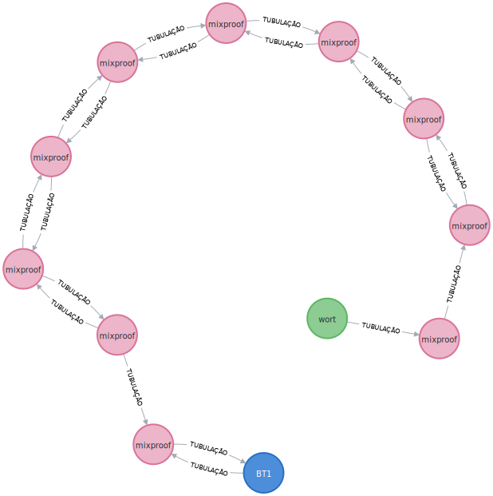

<table>
<tr>
<td>

</td>
<td>
</td>
</tr>
</table>

# One beer to you

**Conteúdo**

- [One beer to you](#one-beer-to-you)
- [Entendimento do Contexto do Problema](#entendimento-do-contexto-do-problema)
  - [Qual o contexto do problema a ser resolvido](#qual-o-contexto-do-problema-a-ser-resolvido)
  - [Quais os dados disponíveis](#quais-os-dados-disponíveis)
  - [Qual o objetivo do problema](#qual-o-objetivo-do-problema)
    - [Função Objetivo](#função-objetivo)
  - [Qual a tomada de decisão do problema proposto](#qual-a-tomada-de-decisão-do-problema-proposto)
    - [Variáveis de decisão](#variáveis-de-decisão)
  - [Limitações existentes no problema](#limitações-existentes-no-problema)
  - [Representação do problema em um grafo](#representação-do-problema-em-um-grafo)
    - [Representação visual](#representação-visual)
    - [Indicação de solução](#indicação-de-solução)
  - [Análise de complexidade do algoritmo](#análise-de-complexidade-do-algoritmo)
    - [Descrição Detalhada do Algoritmo A-Star:](#descrição-detalhada-do-algoritmo-a-star)
    - [Complexidade de Tempo:](#complexidade-de-tempo)
    - [Pior Caso Detalhado:](#pior-caso-detalhado)
    - [Melhor Caso Detalhado:](#melhor-caso-detalhado)
    - [Teste Empírico](#teste-empírico)
    - [Corretude do algoritimo:](#corretude-do-algoritimo)
  - [Correção do Algoritmo A\* Utilizando Prova por Indução](#correção-do-algoritmo-a-utilizando-prova-por-indução)
    - [Entendimento do Propósito do Algoritmo:](#entendimento-do-propósito-do-algoritmo)
      - [Invariante do Laço:](#invariante-do-laço)
    - [Considerações Finais:](#considerações-finais)
- [Entendimento da Experiência do Usuário](#entendimento-da-experiência-do-usuário)
  - [Persona](#persona)
    - [Alberto Soares](#alberto-soares)
    - [Guilherme Silva](#guilherme-silva)
  - [User Stories](#user-stories)
- [Entendimento do Negócio](#entendimento-do-negócio)
  - [Contexto da Indústria](#contexto-da-indústria)
    - [Contexto atual](#contexto-atual)
    - [Tendência do mercado](#tendência-do-mercado)
    - [Modelo de negócios](#modelo-de-negócios)
    - [Principais players](#principais-players)
    - [5 forças de Porter](#5-forças-de-porter)
  - [Análise SWOT](#análise-swot)
  - [Descrição da solução a ser desenvolvida](#descrição-da-solução-a-ser-desenvolvida)
    - [O problema](#o-problema)
    - [A solução](#a-solução)
    - [Benefícios](#benefícios)
    - [Critérios de sucesso](#critérios-de-sucesso)
  - [Value Proposition Canvas](#value-proposition-canvas)
  - [Matriz de Risco](#matriz-de-risco)
    - [Ameaças](#ameaças)
    - [Oportunidades](#oportunidades)
- [Gerenciamento do grafo](#gerenciamento-do-grafo)
- [Back-end da Aplicação](#back-end-da-aplicação)
  - [Endpoints](#endpoints)
    - [Teste de requisições HTTP](#teste-de-requisições-http)
- [Testes da aplicação integrada](#testes-da-aplicação-integrada)
  - [Teste inicial](#teste-inicial)
- [Referências](#referências)

# Entendimento do Contexto do Problema

## Qual o contexto do problema a ser resolvido
O contexto do problema a ser resolvido envolve a identificação de todas as possibilidades de rotas e a otimização do trajeto dentro de uma fábrica com base em um diagrama P&ID (Diagrama de Processo e Instrumentação). O objetivo é criar e otimizar cenários de rotas possíveis entre pontos de origem e destino dentro de uma fábrica de cerveja. Essa abordagem considera as suas limitações, enquanto, ao mesmo tempo, oferece um uso direto das rotas na programação dos Controladores Lógicos Programáveis (CLPs). Isso pode ajudar a melhorar a eficiência para entender o diagrama e aumentar a produtividade ao encontrar as rotas mais eficazes entre diferentes pontos específicos, contribuindo assim para uma gestão mais eficaz e otimizada dos processos industriais.

## Quais os dados disponíveis

Os dados fornecidos para alcançar uma solução otimizada incluem os diagramas P&ID, que detalham as conexões entre os tanques, as válvulas essenciais e as vias, tubulações, de interligação existentes que promovem o fluxo do processo de produção de cerveja. Esses diagramas oferecem informações adicionais sobre a quantidade de tanques presentes e suas funções específicas, que podem abranger tanto a fermentação quanto a maturação, ou, até mesmo, ambas as etapas, além disso terão os dados da distância dos elementos do mapa da fábrica.

 

## Qual o objetivo do problema
O objetivo principal do problema é criar cenários de rotas através um gerador de rothttps://github.com/2023M5T1-Inteli/grupo5/blob/master/docs/index.md#an%C3%A1lise-de-complexidade-do-algoritmoas, usando dados de um diagrama P&ID da fábrica. Isso envolve a criação de diferentes configurações de caminhos que podem ser percorridos dentro das instalações, levando em consideração as tubulações, conexões de válvulas e outras estruturas indicadas no diagrama.

O objetivo secundário é otimizar essas rotas com base nos dados para encontrar a melhor rota entre um ponto de origem e um ponto de destino fornecidos pelo usuário. Nesse processo de aprimoramento, é analisada uma série de informações para determinar a rota mais eficaz entre um ponto de partida e um ponto de chegada. Estes pontos são definidos pelo usuário e representam locais específicos dentro da fábrica.

### Função Objetivo

No algoritmo de grafos, a meta principal consiste em minimizar a distância percorrida pelo transporte de cerveja. Portanto, a função objetivo é construída somando-se os pesos das arestas que conectam os nós de entrada ou as arestas que ligam os nós de saída no grafo e achando os parâmetros que minimizam esta função.

Escrevendo a função objetivo matematicamente:

$$ min (\frac{1}{2}\cdot  \sum_{i \in N}^{} \sum_{j \in N_{i}^{}}^{} c_{ij}\cdot x_{ij}) $$

Onde:
$N$ Representa o conjunto de todos os nodos.

$N_{i}^{}$ Representa o conjunto de todos os nodos conectados ao i-ésimo nodo.

$c_{ij}$ Representa o peso da aresta entre os nodos i e j, de modo que contextualizando para o nosso problema é a distancia entre dois componentes de um P&ID.

## Qual a tomada de decisão do problema proposto

Para compreender os nodos essenciais no contexto do grafo, assim como definir as arestas e compreender o comportamento direcional e a interconexão entre eles, é importante levar em consideração variáveis relacionadas ao fluxo da adega da cervejaria. Sendo assim, as variáveis de decisão do problema são: a localização dos pontos de origem e destino, as distâncias entre esses pontos, as restrições de movimento, como vazão e direção das tubulações, além de aspectos como a presença de válvulas e o dimensionamento dos tanques. Dentre esses itens, as restrições de movimento e o fluxo dos líquidos podem ser alterados para alcançar o objetivo do projeto. Esses elementos desempenham um papel fundamental na modelagem do grafo e na análise de rotas eficientes. A capacidade de ajustar essas variáveis conforme necessário é essencial para alcançar os objetivos do projeto, otimizando o processo de produção de cerveja e obtendo as rotas mais vantajosas dentro das limitações do sistema.

### Variáveis de decisão 

$x_{ij}$ = distância entre os nós i e j

i - nó de origem
j - nó de destino

## Limitações existentes no problema 

Uma limitação mecânica que deve ser abordada no contexto deste projeto está relacionada às válvulas presentes nas tubulações. Estas válvulas podem impactar a concepção e otimização das rotas no modelo. É necessário considerar que certos percursos podem ser bloqueados ou requerer manobras complexas devido à presença dessas válvulas. 

O desafio reside no fato de que, em algumas situações, não é viável cruzar certas válvulas quando estão em uso para o fluxo de cerveja em diferentes etapas de produção. Essa complexidade mecânica tem um impacto direto na eficiência das soluções propostas no modelo de otimização, destacando a importância de considerar cuidadosamente as características e limitações das válvulas ao procurar por rotas eficientes e realistas.

Além disso, outra limitação existente é que a mesma tubulação não pode ser usada para dois sentidos, ou seja, quando o fluxo de líquido está em um sentido, não é possível passar líquido com fluxo contrário.

Dessa forma, escrevendo as restrições matematicamente:

- temos que as conexões dos nós de entrada devem ser igual a 1:

$$ \sum_{i \in E }^{} \sum_{j \in C_{i}^{\ast E} }^{} x_{ij} + \frac{1}{2}\sum_{i \in E }^{} \sum_{j \in C_{i}^{ E} }^{}  x_{ij} = 1 $$

$$ \sum_{i \in S }^{} \sum_{j \in C_{i}^{\ast S} }^{} x_{ij} + \frac{1}{2}\sum_{i \in S }^{} \sum_{j \in C_{i}^{ S} }^{} x_{ij} = 1 $$

- Além disso, fazendo a generalização para nodos que não são de entradas ou saídas, com o i-ésimo nodo, temos que: 

$$ \sum_{j \in E_{i}}^{} x_{ji} = \sum_{j \in S_{i}}^{} x_{ij} $$

Onde: 

$$ x_{ij} \in \{0, 1\} $$

$E$ Representa o conjunto de todos os nodos de entrada.

$S$ Representa o conjunto de todos os nodos de saída.

$C_{i}^{}$ Representa o conjunto dos nodos que se conectam com o i-ésimo nodo.

$C_{i}^{*}$ Representa o conjunto dos nodos de Ci que não se conectam com outras entradas.

$C_{i}^{E}$ Representa o conjunto dos nodos de Ci que se conectam com as entradas.

$E_{i}$ Representa o conjunto dos nodos que possuem arestas que entram no nodo i.

$S_{i}$ Representa o conjunto dos nodos que possuem arestas que saem do nodo i.

## Representação do problema em um grafo
Para modelarmos o P&ID em um grafo, primeiro identificamos manualmente todos os nós e as ligações entre eles. Para isso, foram considerados tais nós:
- Tanques;
- Entrada e saída de líquidos;
- Válvulas.

Como a quantidade de nós é relativamente alta (cerca de 180 nós), foi elaborada uma forma de padronizar a nomenclatura. Com isso, o diagrama foi dividido em "quadrantes", conforme mostra a figura a seguir:

Figura 1: Quadrantes no P&ID

 

Fonte: Elaboração dos autores

 

Dessa forma, para cada nó foi usado o prefixo do quadrante a qual ele pertence. Por exemplo: os tanques do quadrante A variam de AT1 até AT8, enquanto do quadrante B variam de BT1 até BT8, e assim por diante.

No caso das válvulas, também foram utilizadas padronizações a respeito de quais tubulações passam por aquela válvula. Nesse sentido, foram consideradas 6 tubulações: 
- Wort 2 - Future;
- Wort 1;
- Green Ber Out 1;
- Green Ber Out 2;
- Filtration 1;
- Filtration 2 Future.

Dado isso, as nomenclaturas para cada tubulação ficaram:
- Wort 2 - Future: RWF;
- Wort 1: RW;
- Green Ber Out 1: R1G;
- Green Ber Out 2: R2G;
- Filtration 1: RF;
- Filtration 2 Future: RFF.

Nesse contexto, dentro do diagrama, foram mapeados os nós e as nomenclaturas, como mostra a imagem a seguir: 

Figura 2: Exemplo de nomenclatura no P&ID

 

Fonte: Elaboração dos autores

 

Para generalizar a criação de qualquer outro diagrama no formato de grafo, foi criado três nodos e uma relação, formando a base para armazenar as informações no **Neo4J**.  

 Figura 3: Grafo gerado pelo Neo4J

 

Fonte: Elaboração dos autores

 

Nodos:
- "inout": representa um ponto de entrada ou saída de material para circular dentro da operação. O nodo "inout" possui uma propriedade chamada "name", a qual irá diferenciar os diferentes tipos de entrada e saída, como por exemplo "Wort" e "Green Beer Out 2".
- "VALVULA": representa qualquer estrutura que tem como função conectar duas tubulações ou inibir o fluxo entre elas. A "VALVULA" possui uma propriedade chamada "type", a qual identifica um tipo de válvula existente, como por exemplo "mixproof" ou "solenóide".
- "TANQUE": representa os tanques do diagrama P&ID. Este nodo possui a propriedade "name" e "volume", no qual permite diferencia-los entre si, como também permite identificar a capacidade de cada um.

Relação:
- "TUBULACAO": representa as conexões entre os nodos. A relação possui duas propriedades: "type", a qual diferencia cada tipo de tubulação, como por exemplo "Wort" de "Filtration 1", e "length", que armazena o comprimento da tubulação.

### Representação visual

Para melhor visualização da identificação de cada nó dentro do pdf do P&ID, foi disponibilizado o pdf alterado, que é possível acessar através do arquivo: [P&ID alterado da adega](./pdf/PID_adega.pdf). Com todos os nós mapeados, foram identificados quais nós se conectam entre si. No momento, as arestas não possuem peso. 

Por conseguinte, após o mapeamento de todos os nós e arestas relevantes, foi elaborado o grafo no Neo4J, ficando como mostra a imagem a seguir:

 

Figura 4: Grafo gerado pelo Neo4J

 

Fonte: Elaboração dos autores

 

### Indicação de solução

Para elaborar os caminhos factíveis foi considerado que, após a primeira entrada no tanque, o mosto vira Green Beer, sendo necessário ir para a centrifugação. Após esse processo, ele necessita ir para outro tanque, onde é feita a maturação. Por conseguinte, é preciso ir para alguma válvula que dá acesso à tubulação de filtração, onde, segundo o parceiro, a cerveja ecoa para fora da planta do P&ID.

Dessa forma, para o primeiro caminho factível, é possível acompanhar todo o percurso do mosto até o primeiro tanque do setor B (chamado BT1), passando por todas válvulas necessárias durante o trajeto. Esse percurso representa uma das possíveis alocações do tanque B no processo de fermentação do mosto, tornando-o 'green beer'.

 

Figura 5: Grafo gerado pelo Neo4J

 

Fonte: Elaboração dos autores

 

Em termo das válvulas específicas para o primeiro caso, podemos seguir esse caminho através da sequência: 
wort ➡️ VPN ➡️ ARW1 ➡️ ARW2 ➡️ ARW3 ➡️ ARW4 ➡️ ARW5 ➡️ ARW6 ➡️ BRW1 ➡️ BRWF1 ➡️ BRT1 ➡️ BT1.

Para o segundo caminho factível, o trajeto mostra o percurso do tanque B1, onde a green beer foi produzida, para o nodo 'green beer out 1', o qual é resposável por fazer a centrifugação do líquido.

 

Figura 6: Grafo gerado pelo Neo4J

 

Fonte: Elaboração dos autores

 

Em termo das válvulas específicas para o segundo caso, podemos seguir esse caminho através da sequência: 
BT1 ➡️ BRT1 ➡️ BRWF1 ➡️ BRW1 ➡️ BR1G1 ➡️ NN1GB2 ➡️ green ber out 1.

## Análise de complexidade do algoritmo

O algoritimo escolhido pelo grupo foi o A-Star, de modo que Algoritmo A-Star é amplamente reconhecido na área da resolução de problemas em grafos, devido à sua eficiência na busca do caminho mais curto em um grafo ponderado, como mapas de estradas ou tabuleiros de jogos.

### Descrição Detalhada do Algoritmo A-Star:

O Algoritmo A-Star é uma combinação inteligente do algoritmo de Dijkstra, que garante a descoberta do caminho mais curto, e da busca gulosa (greedy search), que prioriza nós que parecem estar mais próximos do destino. Essa abordagem se destaca ao utilizar uma função heurística para estimar o custo restante até o objetivo a partir de um nó dado. Isso resulta em maior eficiência em comparação ao algoritmo de Dijkstra, especialmente em grafos extensos.

O funcionamento detalhado do Algoritmo A-Star pode ser descrito da seguinte forma:

Inicialização: O algoritmo começa com um nó inicial.

Lista de Nós a Serem Explorados: Mantém uma lista de nós a serem explorados, ordenados pelo custo total estimado.

Expansão de Nós: Em cada passo, o algoritmo expande o nó com o menor custo total estimado.

Cálculo de Custos: Para cada nó vizinho do nó atual, calcula o custo total atual para alcançar esse vizinho e o adiciona à lista de nós a serem explorados se o custo for menor que o custo anterior.

Conclusão: O algoritmo continua até encontrar o nó de destino ou explorar todos os nós disponíveis.

de modo que esta foi a implementação do algoritimo no código do projeto:

Figura 13: Imagem Código

 

Fonte: Elaboração dos autores

### Complexidade de Tempo:

A complexidade de tempo do Algoritmo A-Star pode ser expressa em notações de complexidade, como O (big O), Ω (big Omega) e Θ (big Theta).

Pior Caso (O(b^d)): Este cenário ocorre em um grafo completo, onde cada nó está conectado a todos os outros. Aqui, o número de nós a serem explorados pode crescer rapidamente.

Melhor Caso (Ω(d)): O melhor caso ocorre quando o algoritmo encontra rapidamente o nó de destino, o que implica que a profundidade da solução mais curta, denotada como "d," é alcançada com eficiência.

Caso Médio (Θ(b^d)): O caso médio depende da qualidade da heurística usada para estimar o custo restante. Aqui, "d^*" representa a profundidade da solução ótima.

Importância da Heurística:

A escolha da heurística é essencial para determinar a eficiência do Algoritmo A-Star. Uma heurística precisa pode resultar em uma busca mais eficiente.

### Pior Caso Detalhado:

No pior cenário, o Algoritmo A-Star enfrenta um desafio considerável, explorando todos os nós do grafo antes de encontrar o caminho mínimo. A complexidade de tempo nesse caso é limitada por O(b), onde "b" representa o número máximo de nós na fila de prioridade durante a busca.

### Melhor Caso Detalhado:

No melhor caso, o Algoritmo A-Star encontra o nó de destino imediatamente após o primeiro passo da expansão, resultando em uma complexidade de tempo constante: O(1).

### Teste Empírico

Para comprovar nossas análises teóricas, realizamos um teste empírico detalhado. Este teste examinou a relação entre o número de nós explorados e o tempo de processamento na busca do caminho mais otimizado. Os resultados do benchmark mostraram o tempo médio para calcular o caminho mínimo entre dois nós em um grafo gerado aleatoriamente e a busca entre dois nós aleatórios nesse grafo. Isso confirmou nossa tese exposta acima.

Figura 14: Imagem Benchmark AStar

 

Fonte: Elaboração dos autores

### Corretude do algoritimo:

## Correção do Algoritmo A* Utilizando Prova por Indução

### Entendimento do Propósito do Algoritmo:

Antes de analisarmos a correção do algoritmo A* utilizando a técnica de prova por indução, é fundamental compreender o propósito subjacente. O algoritmo A* é empregado para encontrar o caminho mínimo entre um nó inicial e um nó de destino em um grafo ponderado, otimizando uma função de custo que considera a distância atual e uma estimativa heurística do custo futuro. Isso pode ser formalmente expresso como:

$$
f(v) = g(v) + h(v)
$$

Onde:
- f(v) é a estimativa do custo total mínimo para alcançar o nó de destino passando pelo nó v.
- g(v) é a distância mínima conhecida do nó inicial ao nó \(v\).
- h(v) é uma estimativa heurística do custo futuro de \(v\) ao nó de destino.

#### Invariante do Laço:

Para cada nó v na fila de prioridade, a distância distancia[v] representa a distância mínima conhecida do nó inicial ao nó v, e o custo estimado 
$$
custo[v]
$$
que é uma estimativa válida do custo total mínimo para chegar ao nó de destino passando pelo nó v. Formalmente:

$$
\text{Para } v \text{ na fila de prioridade, } distancia[v] \text{ é a distância mínima conhecida do nó inicial ao nó } v,
$$

$$
\text{e } custo[v] \text{ é uma estimativa do custo total mínimo para alcançar o nó de destino passando por } v.
$$

Para demonstrar a corretude do algoritmo A* usando indução na regra do laço, primeiro definiremos algumas notações e propriedades-chave.

Notações:

G é o grafo que representa o problema.

S é o conjunto de nós visitados até o momento.

V é o conjunto de nós não visitados.

d[v] é a distância atual estimada do nó inicial ao nó v.

h[v] é a estimativa do custo heurístico do nó v ao nó de destino.

f[v] é a estimativa total do custo do nó v, onde f[v] = d[v] + h[v].

Propriedades:

A distância estimada d[v] é a distância real mais curta do nó inicial ao nó v que foi encontrada até o momento.

A estimativa h[v] é uma heurística admissível, ou seja, ela nunca superestima o custo real de chegar ao nó de destino a partir do nó v. Formalmente, h[v] ≤ h*(v), onde h*(v) é o custo real de chegar ao nó de destino a partir do nó v.

A estimativa total f[v] é uma estimativa admissível do custo total para chegar ao nó de destino a partir do nó v. Portanto, f[v] ≤ f*(v), onde f*(v) é o custo real mais curto de chegar ao nó de destino a partir do nó v.

Agora, vamos provar a corretude do algoritmo A* usando indução na regra do laço.

Hipótese de Indução:
Assumimos que, a cada iteração do laço while, o algoritmo A* seleciona o nó v com a menor estimativa total f[v] para expandir.

Base da Indução:
Antes da primeira iteração do laço while, todos os nós, exceto o nó inicial, têm d[v] = ∞ e f[v] = ∞, pois não foram alcançados ainda. Para o nó inicial, d[noInicial] = 0 e f[noInicial] = h[noInicial].

Passo da Indução:
Suponha que, em uma determinada iteração do laço while, o algoritmo A* seleciona o nó v com a menor estimativa total f[v] para expandir. Vamos provar que, após a expansão de v, as propriedades 1, 2 e 3 são mantidas.

Propriedade 1 (Distância Estimada): Após a expansão de v, a distância estimada d[v] de v é a distância real mais curta do nó inicial a v. Isso ocorre porque, se houver um caminho mais curto, ele deve passar por v e v teria sido escolhido como o próximo nó a expandir, o que é uma contradição.

Propriedade 2 (Heurística Admissível): A estimativa heurística h[v] é uma heurística admissível, ou seja, h[v] ≤ h*(v).

Propriedade 3 (Estimativa Total Admissível): A estimativa total f[v] é uma estimativa admissível do custo total para chegar ao nó de destino a partir de v, ou seja, f[v] ≤ f*(v).

Após a expansão de v, os valores de d[u], h[u] e f[u] para todos os nós u adjacentes a v podem ser atualizados, conforme o algoritmo A*. Essas atualizações garantem que as propriedades 1, 2 e 3 sejam mantidas para os nós adjacentes.

Portanto, a cada iteração do laço while, o algoritmo A* seleciona o nó com a menor estimativa total f[v] para expandir, garantindo que ele esteja avançando em direção ao caminho mais curto. Como as propriedades 1, 2 e 3 são mantidas a cada iteração, podemos concluir que o algoritmo A* sempre encontrará o caminho mais curto do nó inicial ao nó de destino.

### Considerações Finais:

A complexidade do Algoritmo A* é influenciada pela profundidade do caminho mais curto e pelo fator de ramificação do grafo de busca. O fator de ramificação é a média de filhos de cada nó no grafo. Em um cenário idealizado, a complexidade pode ser expressa como O(b^d), onde "b" é o fator de ramificação e "d" é a profundidade do caminho mais curto. Essa complexidade está associada a um crescimento exponencial em relação à profundidade da árvore de busca, resultando em um aumento exponencial do tempo de execução conforme a profundidade aumenta, dependendo do fator de ramificação.

# Entendimento da Experiência do Usuário

## Persona

Personas são personificações que retratam o perfil característico do usuário do produto ou de outros indivíduos associados a ele. Essa abordagem possibilita um maior alinhamento do produto com a realidade do público-alvo que irá utilizá-lo. No contexto em questão, foram elaboradas duas personas, que representam um engenheiro e um técnico, ambos da Rockwell, que serão impactados com o projeto.

### Alberto Soares

Figura 7: Persona Alberto Soares

 

 
 Fonte: Elaboração dos autores 

### Guilherme Silva

Figura 8: Persona Guilherme Silva

 

Fonte: Elaboração dos autores

## User Stories

As User Stories (Histórias de Usuário) são uma abordagem ágil para descrever requisitos de software de maneira simples e centrada no usuário. Elas fornecem uma maneira concisa e direta de expressar funcionalidades ou necessidades do usuário. Cada história de usuário captura uma única funcionalidade, seguindo uma estrutura básica que enfatiza quem é o usuário, o que ele deseja fazer e por quê. 

Foram desenvolvidas algumas User Stories focadas no problema e nas necessidades das personas do projeto:

1. Eu, como técnico, quero ter um leitor de P&ID automatizado, para facilitar a estruturação das rotas existentes, para otimizar o tempo do meu trabalho e aumentar a produtividade.

2. Eu, como técnico, quero que o leitor seja capaz de identificar todas as limitações mecânicas, tais como tipos de tanques, direção das tubulações e válvulas, conforme as definições, do que é necessário, por mim, para proporcionar uma compreensão abrangente e concisa das características do sistema.

3. Eu, como engenheiro ou técnico, quero uma interface de software projetada de maneira simplificada e intuitiva, para que eu possa navegar facilmente e interagir de forma eficaz com os elementos de visualização e estruturação de rotas.

4. Eu, como engenheiro ou técnico, desejo que a solução seja escalável, capaz de lidar com um grande número de tanques e conexões, para atender o maior número de demandas.

5. Eu, como engenheiro, quero poder visualizar as rotas geradas de maneira clara e intuitiva, destacando pontos de partida e chegada, bem como os componentes que se encontram ao longo de cada rota, para permitir a identificação precisa de todas as alternativas de trajeto e suas restrições mecânicas associadas.

6. Eu, como engenheiro, quero utilizar um software que leve em conta as propriedades que estabeleci, para de encontrar as rotas otimizadas, de acordo com a necessidade do parceiro, entre pontos de partida e destinos específicos.

# Entendimento do Negócio

## Contexto da Indústria
### Contexto atual 

A busca pela máxima produtividade sempre foi um objetivo na indústria global. O panorama mudou radicalmente com o advento da Indústria 4.0, trazendo a automação nos ambientes fabris.

Esse novo paradigma de produção consegue otimizar processos por meio da utilização de máquinas inteligentes e sistemas conectados. Com dispositivos e sensores inteligentes, as fábricas agora estão intrinsecamente conectadas, coletando dados em tempo real. Esse fluxo de informações é traduzido em homologações valiosas para a tomada de decisões e para o aumento da produtividade.

### Tendência do mercado

A esfera da automação industrial está rapidamente ganhando espaço no mercado global, impulsionada tanto pela crescente demanda por produtos de origem industrial quanto pelos avanços tecnológicos contínuos.

De acordo com as projeções do grupo de pesquisa Precedence Research sobre o mercado mundial, espera-se que esse setor alcance a marca de 412,8 bilhões de dólares até 2030. Isso representa um crescimento de cerca de 109% em relação aos números de 2021. Essa perspectiva promissora abre um horizonte otimista para empresas líderes no segmento, como a Rockwell Automation.

### Modelo de negócios 
  
A Rockwell Automation é uma empresa líder no ramo de automação industrial, oferecendo uma ampla gama de produtos e serviços para diversos setores da indústria. Seu objetivo principal é aumentar a produtividade, eficiência e segurança das operações de seus clientes por meio de soluções em software e hardware especializados.

Com foco em atender ao mercado business-to-business (_B2B_), a empresa fornece soluções abrangentes para as grandes indústrias. A flexibilidade e escalabilidade de suas soluções permitem que os clientes personalizem as tecnologias de automação de acordo com suas necessidades específicas. 
  
Essa companhia de automação oferece uma ampla gama de produtos e serviços que desempenham um papel crucial no âmbito da automação industrial. A empresa disponibiliza hardware e software projetados especificamente para a produção industrial, abrangendo todas as etapas do processo, desde a fabricação até a gestão, monitoramento, controle e logística.

Além disso, a empresa em questão também oferece serviços e suporte, também em forma de softwares, garantindo um funcionamento eficaz e contínuo dos sistemas implementados. Estes serviços incluem análise de dados avançada (analytics), manutenção de dados, comunicação eficiente e assistência em manutenção, tudo isso com o objetivo de melhorar a confiabilidade e a disponibilidade dos processos industriais de seus clientes.

Através de sua abordagem abrangente, a Rockwell Automation se destaca como uma parceira confiável e inovadora para outras empresas que buscam otimizar suas operações. 

### Principais players
  
Com o crescimento contínuo da automação industrial em escala global, a Rockwell Automation enfrenta uma competição acirrada com diversos concorrentes.

Entre eles, destaca-se o conglomerado multinacional alemão, a Siemens AG. A Siemens têm se destacado como uma das 20 empresas mais inovadoras do Brasil pelo segundo ano consecutivo, segundo a versão brasileira da MIT Technology Review de 2023, uma honraria que a Rockwell ainda não conquistou. 

A Siemens é reconhecida por possuir um extenso setor de automação industrial, representando 69% do seu portfólio em indústria digital desde 2022. Esse segmento alcançou um lucro de 4,29 bilhões de dólares no mesmo ano. Esses números ilustram a relevância e o sucesso que a Siemens tem alcançado no campo da automação industrial. 
  
Outra figura de destaque no panorama é o grupo sueco ABB Ltda. Este conglomerado se sobressai pela sua expertise na fabricação de equipamentos elétricos e robóticos. Embora o concorrente englobe diversos outros setores dentro da esfera tecnológica, é notável o prestígio da ABB no âmbito da automação industrial. Especificamente no segmento de "Drive Products," que engloba o controle de motores para ambientes fabris, a ABB registrou um faturamento de aproximadamente 1,75 bilhões de dólares. Nos demais setores semelhantes aos da Rockwell, a ABB também está seguindo uma trajetória ascendente, mantendo-se alinhada com a tendência de crescimento nesse mercado. 
  
Por último, é essencial mencionar outro concorrente notável: a Mitsubishi Electric, afiliada da Mitsubishi Corporation, um proeminente grupo japonês que já fez parte dos influentes zaibatsus. A Mitsubishi Electric continua a se destacar globalmente, mantendo sua reputação. No ano de 2020, a empresa, também conhecida como MELCO, registrou um faturamento de cerca de 265 bilhões de yens japoneses, equivalente a aproximadamente 2,41 bilhões de dólares, somente no campo da automação industrial. 
  
### 5 forças de Porter  
  
As 5 forças de Porter é um modelo feito para analisar a atratividade e competitividade de um negócio no mercado em que ele se encontra. A seguir, cada uma dessas forças será contextualizada para a empresa em análise, a Rockwell Automation: 
  
 1. **Rivalidade entre os concorrentes:** No cenário da automação industrial, a concorrência é bem intensa devido tamanho do mercado e pela grande quantidade de _players_. Nesse contexto, para que a Rockwell consiga firmar o seu lugar na liderança de mercado, ela necessita prezar pela qualidade excepcional de seus produtos. A constante busca por excelência é uma necessidade para enfrentar a competição, pois a Rockwell não apenas defende sua posição, mas também busca constantemente a inovação para superar as expectativas dos clientes, garantindo assim sua relevância. Logo, a rivalidade entre os concorrentes é alta. 
  
 2. **Ameaça de novos entrantes:** No setor da Rockwell, caracterizado pela forte presença de diversas empresas de grande porte, a ameaça de novos entrantes é considerada como baixa a moderada. O cenário competitivo é dominado por empresas estabelecidas que possuem recursos financeiros, fidelidade de clientes e alta capacidade técnica. A entrada bem-sucedida nesse mercado exige a capacidade de oferecer soluções de automação altamente especializadas e customizadas. Por isso, a barreira para a entrada é notável, favorecendo empresas já consolidadas como o negócio em análise. 
  
 3. **Ameaça de produtos substitutos:** A automação industrial, impulsionada pela onda global do modelo industrial 4.0, se apresenta como uma tendência nos setores industriais. Atrelado a isso, está a demanda pela melhoria na qualidade dos produtos industriais e pelo aumento desses insumos, que é mitigada pelo aumento da produtividade concedida por esse ramo de automação. Dada a sua crescente adoção, a probabilidade de surgirem produtos substitutos capazes de substituir os produtos oferecidos pela Rockwell é considerada baixa. 
  
 4. **Poder de negociação dos clientes:** A principal clientela da Rockwell são as grandes indústrias. A vasta gama de produtos e serviços oferecidos atrai um escopo amplo de clientes, abrangendo diversos setores industriais. Como resultado dessa diversificação, o poder de barganha dos clientes tende a ser baixo à moderado. 
  
 5. **Poder de negociação dos fornecedores:** A excelência e o desempenho dos produtos da Rockwell Automation, projetados para operar em ambientes industriais, estabelecem um alto padrão de qualidade. Dessa forma, a empresa possui uma demanda contínua materiais de uma confiabilidade robusta e sensores de grande precisão. Diante disso, os fornecedores que podem entregar materiais e componentes de alto calibre detêm um poder de negociação substancial, tornando o poder de negociação dos fornecedores mais alto.

## Análise SWOT

A análise SWOT é uma ferramenta estratégica que avalia a posição competitiva no mercado. Ela identifica forças (Strengths), fraquezas (Weaknesses), oportunidades (Opportunities) e ameaças (Threats) internas e externas que impactam a empresa. Essa abordagem proporciona uma visão abrangente do ambiente empresarial, auxiliando na formulação de estratégias e decisões informadas para maximizar pontos fortes, mitigar fraquezas, aproveitar oportunidades e enfrentar ameaças.

Para compreender a situação de mercado e ajudar a formular estratégias do projeto, foi realizada uma Análise SWOT da empresa parceira, Rockwell Automation.

Figura 9: Representação da Análise SWOT

 
 Fonte: Elaboração dos autores 

## Descrição da solução a ser desenvolvida 

### O problema

Para desenvolver ou atualizar o software que controla os maquinários responsáveis pela produção da cerveja, o time de tecnologia da Rockwell precisa interpretar o diagrama P&ID, documento que descreve todas as tubulações, vávulas e tonéis.

A interpretação desse documento não é algo trivial, visto que o P&ID é uma imagem, ou seja, não possui seus dados estruturados, fazendo com que, assim, não indique todas as conexões possíveis de maneira tabulada. Por esse motivo, o time dedica muito tempo para estruturar os dados do P&ID para só então desenvolverem o código.

Somado a isso, ainda é preciso dedicar um tempo considerável para otimizar o trajeto entre pontos de origem e destino, considerando as limitações da fábrica.

### A solução

O grupo está trabalhando em duas possíveis soluções para leitura do P&ID através de uma plataforma web:

1. Leitura usando técnicas de visão computacional como *object detection* e *image segmentation* para identificar as vávulas, tonéis e tubulações na imagem.
2. Leitura pelo formato DXF (Drawing Exchange Format), originado pela ferramenta CAD, com o intuito de decifrar as coordenadas dos componentes descritos no arquivo.

Dessa forma, posteriormente os dados serão armazenados no Neo4j, um banco de dados de grafos, onde será possível aplicar algoritmos de otimização para identificar as melhores rotas, considerando as limitações do processo. Os algoritmos personalizados analisarão as conexões complexas entre equipamentos e tubulações, buscando eficiência operacional, redução de tempo e uso otimizado de recursos. 

### Benefícios

O benefício será a automatização e otimização do processo de interpretação e tradução do diagrama P&ID, um processo trabalhoso e manual que diminui, e muito, a produtividade do engenheiro. Além disso, será possível ter as melhores rotas de acordo com a planta da fábrica. Isso irá permitir com que os engenheiros visualizem todas as possíveis rotas, como também as melhores rotas de acordo com os dados de entrada.

### Critérios de sucesso

O critério de sucesso se dará pela otimização do tempo levado para interpretar e  estruturar os grafos do P&ID, como também programar as melhores rotas, a partir da  entrada de um arquivo. Isso será mensurado pela simulação de casos com engenheiros na  execução das tarefas que deverão durar menos de 3 semanas para efetuar todo o escopo, e menos que 2 semanas para a estruturação do P&ID em formato de grafo.

## Value Proposition Canvas
O Value Proposition Canvas é uma ferramenta estratégica que as empresas utilizam para analisar o valor que proporcionam ou podem proporcionar aos clientes. 

Nesse contexto, ele é dividido em duas partes principais: a Proposta de Valor, onde é descrito como os produtos ou serviços atendem às demandas específicas dos clientes, e o Perfil do Cliente, onde são identificados os tipos de clientes e as necessidades deles que a empresa deseja atingir.

Dessa forma, foi elaborado o Value Proposition Canvas para o projeto:

Figura 10: Value Proposition Canvas

  

Fonte: Elaboração dos autores

## Matriz de Risco

A utilização da matriz de risco desempenha um papel crucial em nosso projeto, uma vez que nos auxilia na identificação, avaliação e hierarquização dos possíveis riscos. Esse instrumento proporciona uma compreensão clara e precisa dos obstáculos e das potenciais ameaças que enfrentamos, ao mesmo tempo em que direciona as ações necessárias para reduzir seu impacto. A matriz de risco também estabelece uma base sólida para a constante vigilância dos riscos, possibilitando ajustes nos planos de mitigação de acordo com as mudanças no ambiente do projeto. Resumindo, a matriz de risco desempenha um papel fundamental na garantia do êxito do projeto, permitindo a adoção de medidas preventivas para diminuir ameaças e otimizar oportunidades.

Com isso, foi elaborada a seguinte matriz de risco para o projeto, onde as legendas abaixo da figura explicam o significado das letras, oferecendo insights sobre cada aspecto identificado:

Figura 11: Matriz de Risco

  

Fonte: Elaboração dos autores

### Ameaças

- **A - Restrição a um único tipo de adega**: 
  - Evento: "Desenvolvimento do software limitado a atender apenas uma cervejaria específica."
  - Ação mitigadora: Expandir a flexibilidade do software para atender a várias cervejarias e suas distintas variações de processos, incluindo modularidade para configurações diversas.

- **B - Falta de restrições para alimentar o modelo:** 
  - Evento: "Ausência de restrições, como mecânicas e de fluxo, na alimentação do modelo."
  - Ação mitigadora: Permitir diversas restrições, como mecânicas e fluxo, para melhor refletir o ambiente da cervejaria.

- **C - Má otimização das rotas:** 
  - Evento: "Seleção de rotas não otimizadas em termos de eficiência, tempo, recursos e restrições mecânicas."
  - Ação mitigadora: Reforçar o algoritmo de otimização para incorporar eficiência, tempo, recursos e restrições mecânicas na seleção das rotas.

- **D - Não utilização do nosso sistema:** 
  - Evento: "Baixa adesão à ferramenta por parte dos usuários."
  - Ação mitigadora: Garantir uma interface de usuário intuitiva, treinamento e suporte para incentivar a adesão da ferramenta.

- **E - Falha na identificação de todas as rotas possíveis:** 
  - Evento: "Incapacidade de identificar todas as rotas possíveis no processo de produção."
  - Ação mitigadora: Aprimorar os algoritmos para garantir a identificação completa das rotas.

### Oportunidades

- **F - Comparação com resultados anteriores:** 
  - Evento: "Rockwell fornece resultados de projetos anteriores, permitindo comparações com os resultados da nossa solução."
  - Ação para aproveitar: Utilizar os resultados anteriores fornecidos pela Rockwell para melhorar e validar nossa solução.

- **G - Entrega dos dados sobre restrições mecânicas:** 
  - Evento: "Recebimento de informações detalhadas sobre as restrições mecânicas do ambiente."
  - Ação para aproveitar: Incorporar informações sobre restrições mecânicas para desenvolver um modelo mais preciso e considerar limitações físicas na otimização de rotas.

- **H - Entrega de outros P&ID's para testes:** 
  - Evento: "Disponibilidade de P&ID's de diferentes cervejarias para testar e aprimorar a ferramenta em cenários diversos."
  - Ação para aproveitar: Utilizar P&ID's de diferentes cervejarias para testar e aprimorar a ferramenta em cenários diversos.

# Gerenciamento do grafo

Para a resolução do problema apresentado pelo cliente no contexto de otimização de processos de produção de cerveja e a facilitação na visualização das plantas das fábricas, a equipe utilizou técnicas de modelagem em grafos. Para alcançar esse objetivo, foi escolhido o banco de dados NoSQL Neo4j devido à sua natureza de armazenamento e consulta baseada em grafos. Além disso, um backend foi desenvolvido utilizando o framework SpringBoot para interagir com o banco de dados Neo4j e fornecer operações CRUD.

O SpringBoot é um framework de desenvolvimento de aplicações Java. Ele foi adotado para construir o backend que interage com o banco de dados Neo4j. O backend consiste em um conjunto de endpoints que permitem realizar operações CRUD (Create, Read, Update e Delete) no banco de dados. Cada endpoint é mapeado para uma funcionalidade específica, como a criação de novos elementos, recuperação de informações, atualização de dados e exclusão de registros.

Uma etapa fundamental na resolução desses problema foi a abstração do modelo de grafos em objetos, seguindo o paradigma da programação orientada à objetos. Cada elemento relevante do processo, como tanques, válvulas e "In and Outs" de cerveja, foi representado como um nó e as conexões físicas entre esses elementos foram modeladas como arestas, representando as tubulações utilizadas para o transporte das substâncias.

# Back-end da Aplicação

## Endpoints

Abaixo, segue a lista dos endpoints e a função de cada um deles para o gerenciamento do grafo:

| Endpoint                 | Método | Função                                                       |
|--------------------------|--------|--------------------------------------------------------------|
| /api/valves/             | GET    | Listar todas as válvulas                                     |
| /api/valves/id={id}      | GET    | Filtrar válvulas por ID                                      |
| /api/valves/name={nome}  | GET    | Filtrar válvulas por nome                                    |
| /api/valves/id={id}      | PUT    | Atualizar válvulas por ID                                    |
| /api/valves/id={id}      | DELETE | Deletar válvulas por ID                                      |
| /api/valves/name={nome}  | DELETE | Deletar válvulas por nome                                    |
| /api/valves/register     | POST   | Adicionar novas válvulas                                     |
| /api/tanks/              | GET    | Listar todos os tanques                                      |
| /api/tanks/id={id}       | GET    | Filtrar tanques por ID                                       |
| /api/tanks/name={nome}   | GET    | Filtrar tanques por nome                                     |
| /api/tanks/id={id}       | PUT    | Atualizar tanques por ID                                     |
| /api/tanks/id={id}       | DELETE | Deletar tanques por ID                                       |
| /api/tanks/name={nome}   | DELETE | Deletar tanques por nome                                     |
| /api/tanks/register      | POST   | Adicionar novos tanques                                      |
| /api/inouts/             | GET    | Listar todos os "In and Outs"                                |
| /api/inouts/id={id}      | GET    | Filtrar "In and Outs" por ID                                 |
| /api/inouts/name={nome}  | GET    | Filtrar "In and Outs" por nome                               |
| /api/inouts/id={id}      | PUT    | Atualizar "In and Outs" por ID                               |
| /api/inouts/id={id}      | DELETE | Deletar "In and Outs" por ID                                 |
| /api/inouts/name={nome}  | DELETE | Deletar "In and Outs" por nome                               |
| /api/inouts/register     | POST   | Adicionar novos "In and Outs"                                |
| /api/paths/              | GET    | Listar todas as tubulações                                   |
| /api/paths/id={id}       | GET    | Filtrar tubulações por ID                                    |
| /api/paths/sourceId={id} | GET    | Filtrar todas as tubulações que saem do nó por ID desse nó   |
| /api/paths/targetId={id} | GET    | Filtrar todas as tubulações que entram no nó por ID desse nó |
| /api/paths/register      | POST   | Adicionar novas tubulações                                   |
| /api/paths/delete        | DELETE | Deletar tubulações por ID                                    |
| /api/paths/Adjacency        | GET | Retorna a lista de nodos adjacentes para cada nó existente.                                    |
| /api/paths/Dijkstra?begin={idBegin}&end={idEnd}        | GET | Retorna o melhor caminho entre 2 nós com base no algoritmo Dijkstra.                                    |
| /api/paths/AStar?begin={idBegin}&end={idEnd}        | GET | Retorna o melhor caminho entre 2 nós com base no algoritmo A*.      |
| /api/csv/uploadTanque       | POST   | Criação de nodos de label TANQUE através de arquivo CSV injetado (utilização desses [arquivos](./excel_csv) para teste)             |
| /api/csv/uploadValvula      | POST   | Criação de nodos de label VALVULA através de arquivo CSV injetado (utilização desses [arquivos](./excel_csv) para teste)             |
| /api/csv/uploadInout       | POST   | Criação de nodos de label INOUT através de arquivo CSV injetado (utilização desses [arquivos](./excel_csv) para teste)             |
| /api/csv/uploadRelation       | POST   | Criação de relacionamentos entre nodos através de arquivo CSV injetado (utilização desses [arquivos](./excel_csv) para teste)             |

### Teste de requisições HTTP
O HTTP é um protocolo amplamente utilizado para a comunicação entre servidores e clientes na web, sendo a base para a troca de informações em sites, aplicativos web e APIs. Os testes de requisições HTTP geralmente são realizados para garantir que as solicitações e respostas HTTP estejam funcionando corretamente, de acordo com as especificações e requisitos estabelecidos. 

Para garantir o funcionamento adequado da API que o backend confeccionado representa, todas as requisições de cada endpoint foram testadas utilizando o ambiente [Insomnia](https://insomnia.rest/) e o [Postman](https://www.postman.com/).

A testagem dos endpoints realizada pode ser importada por esse programa para que a integridade da aplicação desenvolvida seja confirmada. Segue o link para o download do arquivo de teste. 

[Arquivo de teste](../codigo/backend/onebeertwo/httpTests/postman_collection.json)

Com base nele, é possível analisar todos os testes realizados e os resultados deles, ao ampliar a requisição realizada no próprio Postman, incluindo testes de cenários essenciais e produzindo resultados apropriados para as entradas fornecidas.

Figura 12: Ambiente de testes

  

Fonte: Elaboração dos autores

# Testes da aplicação integrada

A realização de testes na aplicação integrada desempenha um importante papel no projeto. Esses testes permitem a identificação e a correção de erros, além de garantir que a aplicação possui uma boa usabilidade e que ela compreende o seu propósito inicial.

## Teste inicial

Abaixo, foram realizados alguns testes iniciais para verificar se a aplicação funciona de forma integrada e se as funções desempenhadas por ela possuem resultados satisfatórios.

| ID | Ação                                                 | Resultado esperado                                                      | Resultado obtido                              | Status |
|----|------------------------------------------------------|-------------------------------------------------------------------------|-----------------------------------------------|--------|
| 0  | Carregar a página inicial                            | Visualização dos projetos                                               | Vizualização dos projetos                     | OK     |
| 1  | Passar o mouse em cima de um projeto                 | Vizualização das "actions" (Edição e deleção)                           | Vizualização das "actions" (Edição e deleção) | OK     |
| 2  | Clicar no botão de editar projeto                    | Campo para fazer input de um novo nome                                  | Campo para fazer input de um novo nome        | OK     |
| 3  | Clicar em no ícone de OK após mudar o nome do projeto | Nome do projeto muda na página inicial                                  | Nome do projeto muda na página inicial        | OK     |
| 4  | Clicar no botão de deletar projeto                   | "Pop up" de um modal de confirmação                                     | "Pop up" de um modal de confirmação                                              | OK     |
| 5  | Clicar no botão de deletar no modal de confirmação   | Projeto deletado e fora da página inicial                               |Projeto deletado e fora da página inicial                                                                                  | OK     |
| 6  | Clicar no botão de cancelar no modal de confirmação  | Projeto não é deletado e usuário volta para a página incial             |Projeto não é deletado e usuário volta para a página incial                                                                                                                           | OK     |
| 7  | Clicar no projeto escolhido                          | Redirecionamento para a página do projeto escolhido                     |Redirecionamento para a página do projeto escolhido                                                                                                                                                                                      | OK     |
| 8  | Escolher entrada e saída e fazer a procura           | Visualização do melhor caminho e dos outros caminhos possíveis em baixo |Visualização do melhor caminho e dos outros caminhos possíveis em baixo                                                                                                                                                                                                                                         | OK     |
| 9  | Ecolher um caminho específico                        | Vizualização do caminho escolhido                                       |Vizualização do caminho escolhido                                                                                                                                                                                                                                                                                                                | OK     |

# Referências

**ABB Investors.** Disponível em: <https://global.abb/group/en/investors>. Acesso em: 7 ago. 2023.
**About Us | Rockwell Automation United States.** Disponível em: <https://www.rockwellautomation.com/en-us/company/about-us.html>. Acesso em: 3 ago. 2023.
**Gazzconecta. MIT Technology Review divulga as 20 empresas mais inovadoras do Brasil.** Disponível em: <https://www.gazetadopovo.com.br/gazz-conecta/mit-technology-review-divulga-lista-das-20-empresas-mais-inovadoras-do-brasil-curitibana-hilab-esta-entre-as-selecionadas/>. Acesso em: 4 ago. 2023.
**Industrial Automation Market Size.** Disponível em: <https://www.precedenceresearch.com/industrial-automation-market>. Acesso em: 7 ago. 2023.
**Siemens Press.** Disponível em: <https://press.siemens.com/global/en>. Acesso em: 4 ago. 2023.